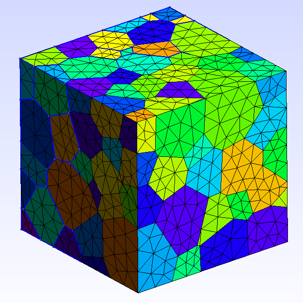
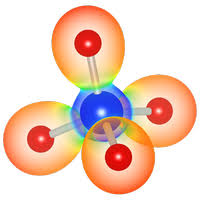

  
    
  
   
  

 

  <samp>
    Hey! My name is Paulina (Paul) and I'm a third-year PhD student in the <a href="https://graeve.ucsd.edu/">Xtreme Materials Laboratory</a> at UC San Diego, under the supervision of Dr. Olivia A. Graeve. My research focuses on the diffusion coefficients in grains and grain boundaries of ultra-high temperature ceramics (UHTCs). I'm also repairing an electrospinning machine and working toward applying finite element analysis to bulk ceramics and grain boundaries. I'm interested in machine learning as well, specifically machine learning interatomic potentials (MLIPs), which I hope to use in my research soon.
  </samp>

  

  
    
  <table>
    <tr align="center">
      <td align="center" width="220" bgcolor="#10141D" style="border: 2px solid #89CFF0; border-radius: 8px;">
        <a href="https://www.quantum-espresso.org/">
           
          
            
          <b>Quantum ESPRESSO</b>
            
        </a>
      </td>
      <td align="center" width="220" bgcolor="#10141D" style="border: 2px solid #89CFF0; border-radius: 8px;">
        <a href="https://neper.info/">
           
          
            
          <b>Neper & Gmsh</b>
            
        </a>
      </td>
      <td align="center" width="220" bgcolor="#10141D" style="border: 2px solid #89CFF0; border-radius: 8px;">
        <a href="https://jp-minerals.org/vesta/en/">
           
          
            
          <b>VESTA</b>
            
        </a>
      </td>
    </tr>
  </table>

  

  
    
  
  

